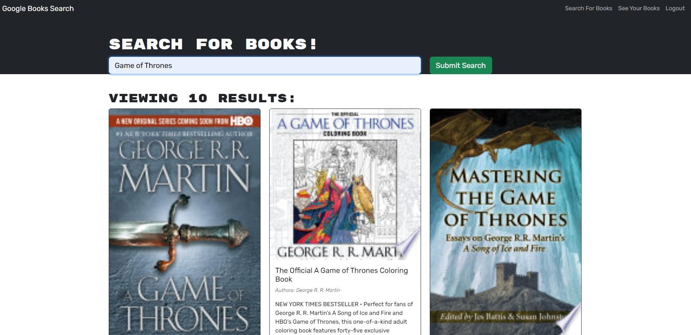
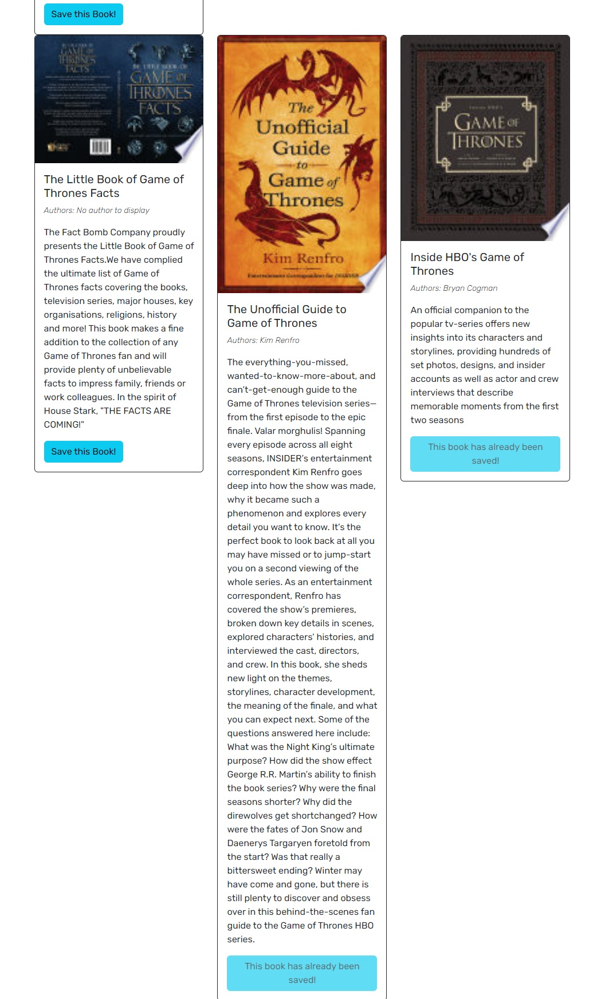
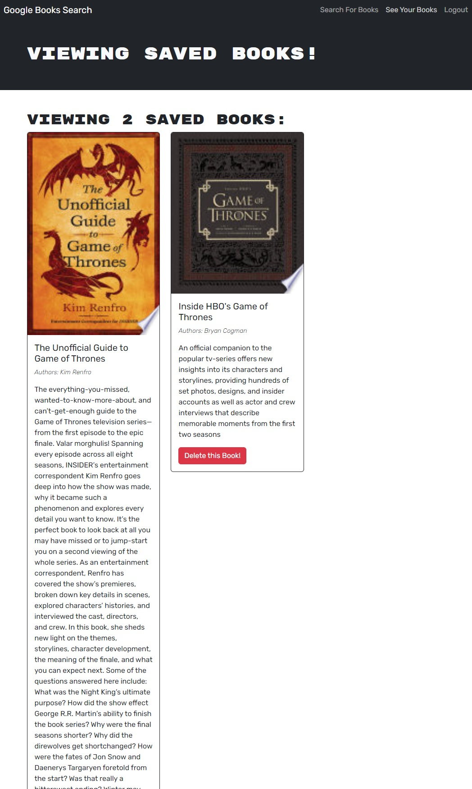
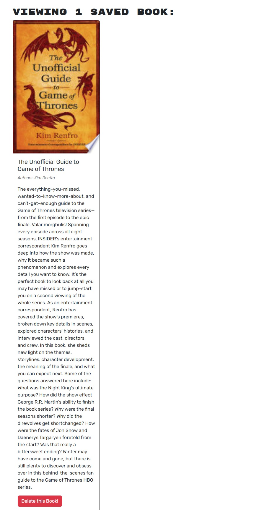
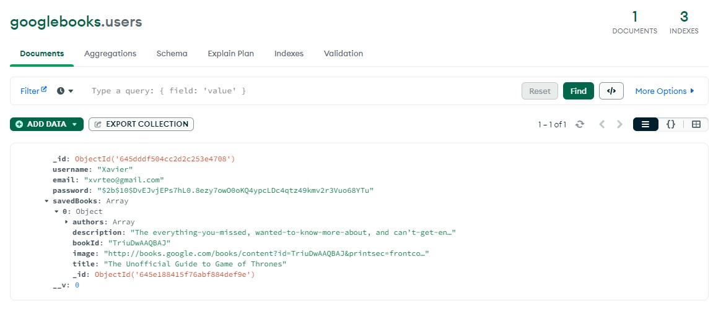

# Book-Search-Engine

## Description

This is a MERN stack application using the Google Books API and operates as a book search engine. Using the starter code with a fully functioning Google Books API search engine built with a RESTful API, it has now been refactored to be a GraphQL API built with Apollo Server. Apart from book searching, users have the ability to register and log in to their accounts in order to save their favorite books.

## Screenshots

Logging in:

Searching for books:

Saved two books:

Displaying saved books when clicking on "See Your Books":

Deleted one of the books:

What's reflected in MongoDB:

### Links:

1. URL of the functional, deployed application: https://ancient-anchorage-14832.herokuapp.com/

2. URL of the GitHub repository: https://github.com/XvrTeo/Book-Search-Engine
